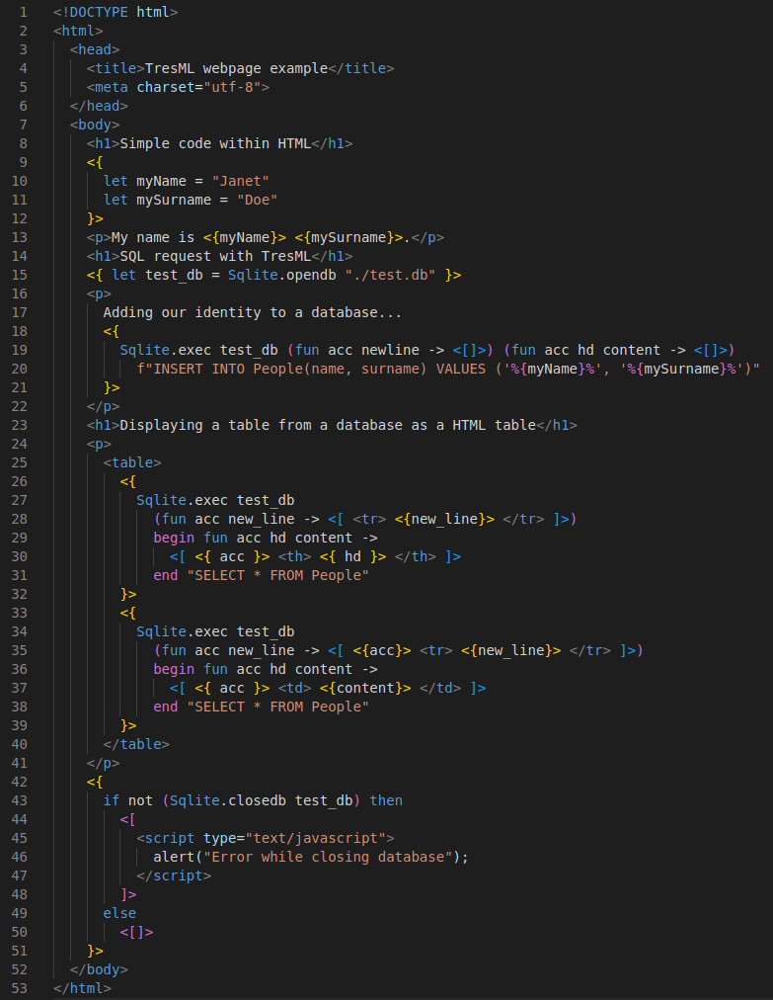
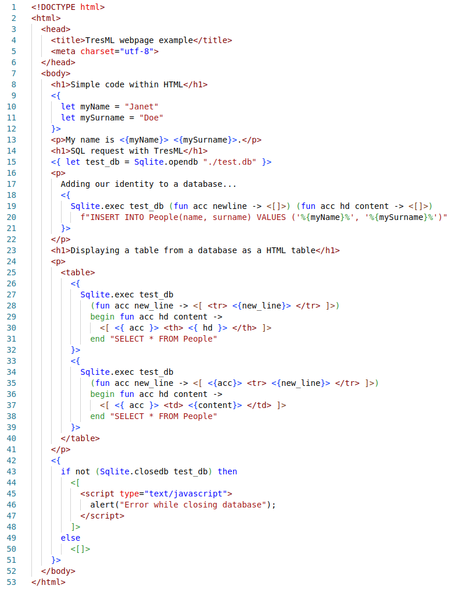

# TresML VSCode extension

Official [TresML](https://github.com/Ilianmgh/tresfreroserver.git) language extension for VSCode.

## Features

Syntax highlighting for TresML source files.

Example:

With a dark mode:

With a light mode:

<!-- ## Requirements -->

<!-- ## Extension Settings -->

<!-- ## Known Issues -->